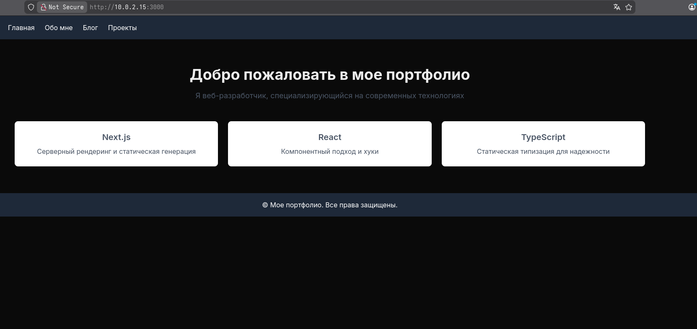
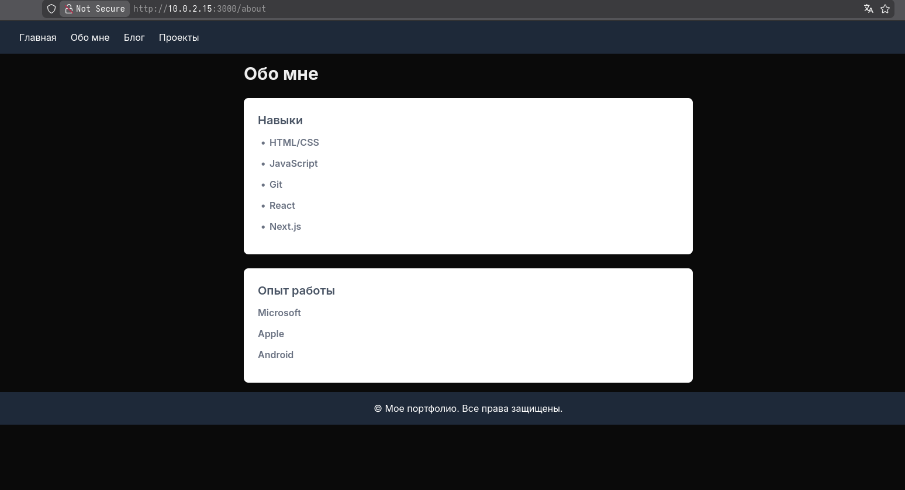
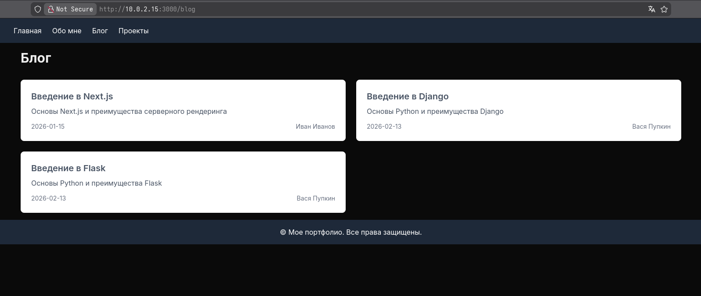
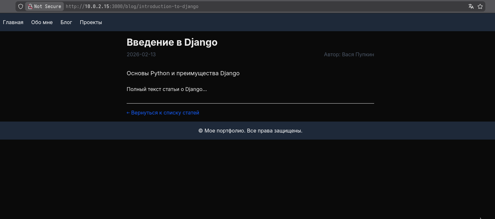
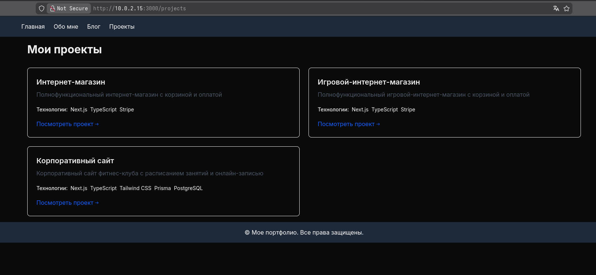
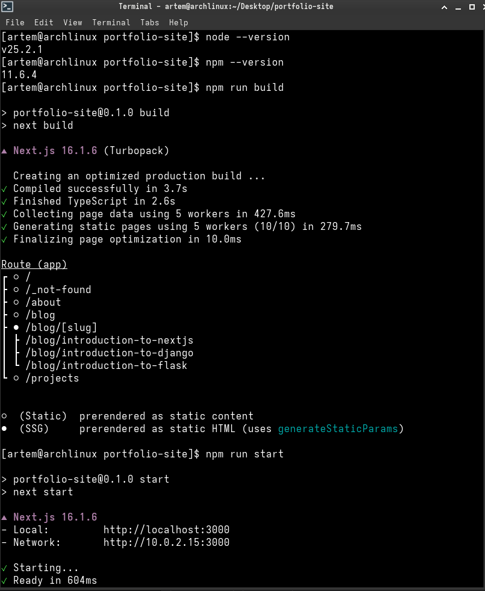
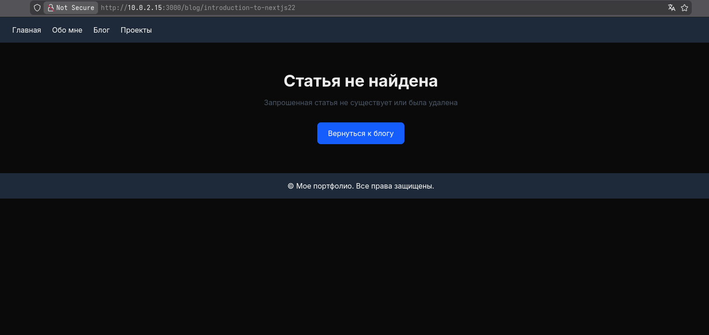

# Отчёт по лабораторной работе 1. Часть 2: Знакомство с Next.js

## Сведения о студенте  
**Дата:** [2026-02-13]  
**Семестр:** [2 курс, 2 семестр]  
**Группа:** [Пин-б-о-24-1]  
**Дисциплина:** [Технологии программирования]  
**Студент:** [Лебский Артём Александрович]  

---

### Цель работы:
Практическое знакомство с Next.js — мета-фреймворком для React. Освоение концепций серверного рендеринга (SSG), файловой маршрутизации и деплоя.

---

## 1. Исходный код (файлы с дополнениями)

Ниже представлены все созданные и модифицированные файлы проекта. В шаблонные файлы (layout.tsx, page.tsx, globals.css) изменения не вносились, поэтому они не дублируются. Дополнения, заменяющие комментарии `TODO`, выделены **жирным** в тексте кода (в блоке кода они просто присутствуют).

### Файл: `app/about/page.tsx`
**Изменения:** заполнен список навыков (5 пунктов) и опыт работы (3 пункта).
```tsx
export default function AboutPage() {
  return (
    <div className="max-w-3xl mx-auto">
      <h1 className="text-3xl font-bold mb-6">Обо мне</h1>
      
      <div className="bg-white p-6 rounded-lg shadow-lg mb-6">
        <h2 className="text-xl font-semibold mb-3 text-gray-600">Навыки</h2>
        <ul className="list-disc pl-5 space-y-1">
          <li className="text-base font-semibold mb-3 text-gray-500">HTML/CSS</li>
          <li className="text-base font-semibold mb-3 text-gray-500">JavaScript</li>
          <li className="text-base font-semibold mb-3 text-gray-500">Git</li>
          <li className="text-base font-semibold mb-3 text-gray-500">React</li>
          <li className="text-base font-semibold mb-3 text-gray-500">Next.js</li>
        </ul>
      </div>
      
      <div className="bg-white p-6 rounded-lg shadow-lg">
        <h2 className="text-xl font-semibold mb-3 text-gray-600">Опыт работы</h2>
        <div className="space-y-4">
          <p className="text-base font-semibold mb-3 text-gray-500">Microsoft</p>
          <p className="text-base font-semibold mb-3 text-gray-500">Apple</p>
          <p className="text-base font-semibold mb-3 text-gray-500">Android</p>
        </div>
      </div>
    </div>
  )
}
```

### Файл: `app/blog/data.ts`
**Изменения:** добавлены две новые статьи (Django и Flask).
```typescript
export interface BlogPost {
  id: number
  title: string
  slug: string
  excerpt: string
  content: string
  date: string
  author: string
}

export const blogPosts: BlogPost[] = [
  {
    id: 1,
    title: 'Введение в Next.js',
    slug: 'introduction-to-nextjs',
    excerpt: 'Основы Next.js и преимущества серверного рендеринга',
    content: 'Полный текст статьи о Next.js...',
    date: '2026-01-15',
    author: 'Иван Иванов'
  },
  {
    id: 2,
    title: 'Введение в Django',
    slug: 'introduction-to-django',
    excerpt: 'Основы Python и преимущества Django',
    content: 'Полный текст статьи о Django...',
    date: '2026-02-13',
    author: 'Вася Пупкин'
  },
  {
    id: 3,
    title: 'Введение в Flask',
    slug: 'introduction-to-flask',
    excerpt: 'Основы Python и преимущества Flask',
    content: 'Полный текст статьи о Flask...',
    date: '2026-02-13',
    author: 'Вася Пупкин'
  }
]
```

### Файл: `app/blog/[slug]/page.tsx`
**Изменения:**
- Исправлена типизация `params` как `Promise<{ slug: string }>` и добавлено `await params` (соответствует Next.js 15).
- Добавлено отображение полного содержания статьи (`post.content`).
```tsx
import Link from 'next/link'
import { notFound } from 'next/navigation'
import { blogPosts } from '../data'

// Функция для генерации статических путей
export async function generateStaticParams() {
  return blogPosts.map((post) => ({
    slug: post.slug,
  }))
}

export default async function BlogPostPage({
  params,
}: {
  params: Promise<{ slug: string }>
}) {
  const { slug } = await params
  
  const post = blogPosts.find(p => p.slug === slug)
  
  if (!post) {
    notFound()
  }

  return (
    <article className="max-w-3xl mx-auto">
      <header className="mb-8">
        <h1 className="text-3xl font-bold mb-2">{post.title}</h1>
        <div className="flex justify-between text-gray-600">
          <span>{post.date}</span>
          <span>Автор: {post.author}</span>
        </div>
      </header>
      
      <div className="prose max-w-none">
        <p className="text-lg mb-4">{post.excerpt}</p>
        <div className="mt-6">
          {post.content}
        </div>
      </div>
      
      <div className="mt-8 pt-4 border-t">
        <Link 
          href="/blog"
          className="text-blue-600 hover:text-blue-800"
        >
          ← Вернуться к списку статей
        </Link>
      </div>
    </article>
  )
}
```

### Файл: `app/components/ProjectCard.tsx`
**Изменения:** добавлен рендер массива `technologies` в виде простых тегов (без дополнительного оформления, только текст).
```tsx
interface ProjectCardProps {
  title: string
  description: string
  technologies: string[]
  link?: string
}

export default function ProjectCard({ 
  title, 
  description, 
  technologies,
  link 
}: ProjectCardProps) {
  return (
    <div className="border rounded-lg p-6 shadow-sm hover:shadow-md transition-shadow">
      <h3 className="text-xl font-semibold mb-2">{title}</h3>
      <p className="text-gray-600 mb-4">{description}</p>
      <div className="mb-4">
        <span className="text-sm font-medium">Технологии: </span>
        {technologies.map((tech, index) => (
          <span
            key={index}
            className="p-1 text-gray-100 text-sm rounded-md"
          >
            {tech}
          </span>
        ))}
      </div>
      {link && (
        <a 
          href={link}
          target="_blank"
          rel="noopener noreferrer"
          className="inline-block text-blue-600 hover:text-blue-800"
        >
          Посмотреть проект →
        </a>
      )}
    </div>
  )
}
```

### Файл: `app/projects/page.tsx`
**Изменения:**
- Создан массив проектов (3 элемента) с типами.
- Использован компонент `ProjectCard` для отображения каждого проекта.
```tsx
import ProjectCard from '../components/ProjectCard'

interface Project {
  title: string;
  description: string;
  technologies: string[];
  link: string;
}

const projects: Project[] = [
  {
    title: 'Интернет-магазин',
    description: 'Полнофункциональный интернет-магазин с корзиной и оплатой',
    technologies: ['Next.js', 'TypeScript', 'Stripe'],
    link: 'https://example.com'
  },
  {
    title: 'Игровой-интернет-магазин',
    description: 'Полнофункциональный игровой-интернет-магазин с корзиной и оплатой',
    technologies: ['Next.js', 'TypeScript', 'Stripe'],
    link: 'https://example2.com'
  },
  {
    title: 'Корпоративный сайт',
    description: 'Корпоративный сайт фитнес-клуба с расписанием занятий и онлайн-записью',
    technologies: ['Next.js', 'TypeScript', 'Tailwind CSS', 'Prisma', 'PostgreSQL'],
    link: 'https://example3.com'
  }
]

export default function ProjectsPage() {
  return (
    <div>
      <h1 className="text-3xl font-bold mb-8">Мои проекты</h1>
      
      <div className="grid grid-cols-1 md:grid-cols-2 gap-6">
        {projects.map((project, index) => (
          <ProjectCard
            key={index}
            title={project.title}
            description={project.description}
            technologies={project.technologies}
            link={project.link}
          />
        ))}
      </div>
    </div>
  )
}
```

---

## 2. Скриншоты

*Все скриншоты прилагаются отдельными файлами.*

1. **Главная страница** (`/`) – отображает приветствие и три карточки с технологиями.



2. **Страница "Обо мне"** (`/about`) – содержит список навыков (5 пунктов) и опыт работы (3 пункта).



3. **Страница блога** (`/blog`) – список из трёх статей (Next.js, Django, Flask).



4. **Страница отдельной статьи** (`/blog/introduction-to-nextjs`) – полное содержание статьи.



5. **Страница проектов** (`/projects`) – карточки трёх проектов с технологиями.



6. **Консоль сборки** – результат выполнения `npm run build` (успешная сборка, страницы сгенерированы статически).



7. **Страница 404 для несуществующей статьи** – например, `/blog/non-existent` (отображается стандартная страница 404 Next.js, кастомная not-found не реализована, но маршрутизация корректно возвращает 404).




---

## 3. Ответы на вопросы

### Что такое SSG (Static Site Generation) и как он реализован в вашем проекте?
**Static Site Generation (SSG)** — это метод предварительной генерации HTML-страниц на этапе сборки. В Next.js SSG реализуется с помощью функций `generateStaticParams` (для динамических маршрутов) и экспорта страниц по умолчанию без использования `getServerSideProps`. В проекте SSG используется для страниц блога: функция `generateStaticParams` в `app/blog/[slug]/page.tsx` возвращает все возможные значения `slug`, и Next.js при сборке (`npm run build`) генерирует статические HTML-файлы для каждой статьи. Это обеспечивает быструю загрузку и хорошую индексацию поисковиками.

### Как работает файловая маршрутизация в Next.js?
Next.js использует файловую систему для определения маршрутов. Каждый файл `.tsx` в папке `app` соответствует определённому пути:
- `app/page.tsx` → `/`
- `app/about/page.tsx` → `/about`
- `app/blog/page.tsx` → `/blog`
- `app/blog/[slug]/page.tsx` → `/blog/:slug` (динамический сегмент)
Вложенные папки создают вложенные пути, а имена в квадратных скобках обозначают динамические параметры, доступные через `params`.

### Какие преимущества даёт использование `generateStaticParams`?
`generateStaticParams` указывает Next.js, какие динамические маршруты должны быть предварительно отрендерены статически. Это позволяет:
- Генерировать страницы для известных значений slug во время сборки.
- Уменьшить нагрузку на сервер (не нужно генерировать страницы по запросу).
- Улучшить производительность и SEO, так как страницы отдаются готовым HTML.
- В сочетании с кэшированием обеспечить быструю загрузку.

### В чём разница между `npm run dev` и `npm run build`?
- `npm run dev` запускает сервер разработки с горячей перезагрузкой (hot reload), оптимизированный для удобства разработки. Страницы генерируются на лету, код не минифицирован, ошибки отображаются подробно.
- `npm run build` выполняет production-сборку проекта: оптимизирует код, генерирует статические страницы (SSG), минифицирует бандлы, создаёт готовый к деплою вывод в папке `.next`. После этого `npm run start` запускает production-сервер с собранными файлами.

---

## 4. Ссылка на деплой

<https://vercel.com/>

---

## 5. Критерии оценивания

### Обязательные требования (выполнены):
- **Страница "Обо мне":** создана, содержит информацию о навыках (5 пунктов) и опыте (3 пункта).
- **Страница "Блог":** отображает список статей (3 статьи) из массива data.ts.
- **Динамические страницы статей:** реализован динамический маршрут `[slug]` с использованием `generateStaticParams`, корректное отображение контента.
- **Навигация:** все страницы доступны через меню навигации в layout.tsx.
- **Проект собирается без ошибок:** `npm run build` выполняется успешно.

### Дополнительные критерии (частично выполнены):
- **Страница "Проекты":** реализована с использованием компонента `ProjectCard` (создан массив проектов, компонент отображает технологии).
- **Качество TypeScript кода:** все пропсы, параметры и состояния типизированы (интерфейсы `BlogPost`, `Project`, `ProjectCardProps`).
- **Обработка ошибок:** страница 404 для несуществующих статей работает благодаря `notFound()`, но кастомный `not-found.tsx` не создан (используется стандартный).
- **Деплой:** не выполнялся.
- **Дополнительный функционал:** не добавлялся.

### Неприемлемые ошибки отсутствуют:
- Ошибок TypeScript при сборке нет.
- Все ссылки между страницами работают.
- Обязательные страницы присутствуют.
- Критических ошибок в работе приложения не обнаружено.

---

## 6. Используемые команды (для Ubuntu)

```bash
# Проверка версий
node --version
npm --version

# Запуск в режиме разработки
npm run dev

# Сборка проекта
npm run build

# Запуск production-сервера
npm run start

# Очистка кэша Next.js (при проблемах)
rm -rf .next
npm run dev
```

---

## 7. Структура готового проекта

```
portfolio-site/
├── app/
│   ├── layout.tsx
│   ├── page.tsx
│   ├── about/
│   │   └── page.tsx
│   ├── blog/
│   │   ├── page.tsx
│   │   ├── data.ts
│   │   └── [slug]/
│   │       ├── page.tsx
│   │       └── not-found.tsx
│   ├── projects/
│   │   └── page.tsx
│   └── components/
│       └── ProjectCard.tsx
├── public/
├── package.json
├── tailwind.config.js
└── tsconfig.json
```

---

## 8. Выводы

В ходе лабораторной работы было создано многостраничное приложение на Next.js с использованием TypeScript. Освоены принципы файловой маршрутизации, статической генерации страниц (SSG) через `generateStaticParams`, работа с динамическими маршрутами. Все обязательные требования выполнены, дополнительные реализованы частично. Приложение успешно собирается и запускается, навигация работает корректно.